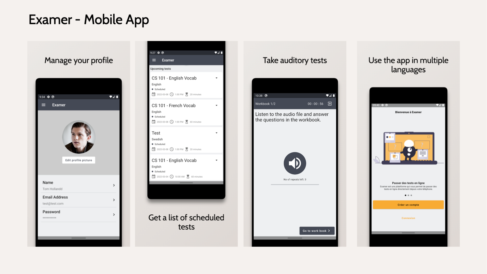
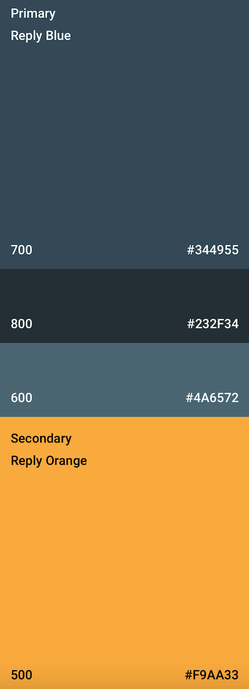

# Examer 📖 

Examer is an Android app that is used to take tests that evaluate a person's ability to listen to, and understand conversations in English.
To try out this app you need to use the latest version of [Android Studio Arctic Fox](https://developer.android.com/studio?gclid=EAIaIQobChMInc7OlbDD9QIVmpJmAh2lKgaZEAAYASAAEgLvsfD_BwE&gclsrc=aw.ds).

## Note
Although the app works, the development of this project has been permanently stopped. There is no intention of continuing the development of this project. The features implemented will work, but bugs are bound to exist. The app doesn't handle most of the exceptions, especially those related to network. FCM (Firebase Cloud Messaging) is used in the app, but, the token is just logged and not stored anywhere.

## Table of contents
- [Screenshots](#screenshots)
- [Notable Features](#notable-features)
- [Color Scheme](#color-scheme)
- [Tech Stack](#tech-stack)
- [Source code and architecture](#source-code-and-architecture)

## Screenshots

## Notable Features
- Experimental support for French.
- Supports both 12hr and 24hr time formats based on the device's settings.
- User won’t be allowed to use the app if the date/time or time zone is set manually.

## Color Scheme
The color palette and the typography used in this app is entirely based on the specification for [Reply app](https://material.io/design/material-studies/reply.html#color), which is one of the many material studies apps maitained by google.

## Tech stack 
- Entirely written in [Kotlin](https://kotlinlang.org/).
- Manual dependency injection.
- [Jetpack Compose](https://developer.android.com/jetpack/compose) for building the UI.
- [Kotlin Coroutines](https://kotlinlang.org/docs/reference/coroutines/coroutines-guide.html) for
  threading.
- [Timber](https://github.com/JakeWharton/timber) for logging.
- [Firebase Authentication](https://firebase.google.com/docs/auth) for user account creation and authentication.
- [Firebase Cloud Firestore](https://firebase.google.com/products/firestore?gclid=EAIaIQobChMIqcK24rDD9QIVCJhmAh12WAxqEAAYASAAEgLMnPD_BwE&gclsrc=aw.ds) for storing data.
- [Firebase Storage](https://firebase.google.com/products/storage) for storing audio files and images.
- [Coil (Compose)](https://coil-kt.github.io/coil/compose/) for image loading and caching.
- [Accompanist library](https://google.github.io/accompanist/) for window insets and pager,pager-indicators,swiperefresh,placeholder.
- [WorkManager](https://developer.android.com/topic/libraries/architecture/workmanager?gclid=EAIaIQobChMIzJLs5aTy9wIVu5NmAh0F4wU7EAAYASAAEgKMn_D_BwE&gclsrc=aw.ds) for persistent background tasks.

## Source code and Architecture
- [Architecture components](https://developer.android.com/topic/libraries/architecture/) such as
  Lifecycle and ViewModels are used.
- [MVVM](https://developer.android.com/jetpack/guide?gclid=EAIaIQobChMI-_GIsejG8QIVzNaWCh0NXQANEAAYASAAEgKZ2fD_BwE&gclsrc=aw.ds)
  architecture is used.
- Source code conforms to the [Kotlin coding conventions](https://kotlinlang.org/docs/coding-conventions.html).
- Dependency injection is done manually.
- [Material design color system](https://material.io/design/color/the-color-system.html#color-usage-and-palettes)
  specification is used for assigning colors to the UI components.
- Commit messages follow
  the [Angular specification](https://github.com/angular/angular/blob/22b96b9/CONTRIBUTING.md#-commit-message-guidelines)
  for commit messages.
- [Github actions](https://github.com/features/actions) for continuous integration (CI).
